 # 🧠  Mapping Initial Status Payments

## 📘 Project Overview

### **Objective**

The goal of this project is to improve the **observability of initiated payments** for **LHV Paytech**.

When an e-shop customer clicks “Make Payment,” the payment journey starts through the Paytech Payment Gateway and provider services. However, tracking these initiated payments has been challenging due to fragmented data sources and poor mapping between initiated and finalized payments.

This project aims to **join the IGW initial payment data with the main DataLake database** to analyze:

* Why initiated payments fail to progress,
* Which payment methods perform best or worst, and
* How to improve the customer payment experience.

---

## 👥 Stakeholders

| Stakeholder          | Benefit                                                                |
| -------------------- | ---------------------------------------------------------------------- |
| **Data Analysts**    | Understand customer behavior and payment patterns                      |
| **System Analysts**  | Identify bugs or inefficiencies in payment methods                     |
| **Customer Support** | Quickly assess the health of payment methods during customer inquiries |

---

## 📊 Key Metrics (KPIs)

1. **≥90%** of initiated payments matched with corresponding real payment records.
2. **Dashboard coverage:** 100% overview of initiated vs. completed/abandoned payments by method.

---

## 💡 Business Questions Answered

* How many initiated payments never reach a payment provider?
* How many initiated payments reach a provider but are abandoned?
* What is the **abandonment rate** by payment method?
* Do some initiated payments finalize using **different methods**?
* Which providers or methods show the **highest non-completion rate**?
* Are there **time-based patterns** (e.g., by day or hour) affecting completion rates?

---

## ⚙️ Tooling

| Purpose                     | Tool                        |
| --------------------------- | --------------------------- |
| Data Storage                | **Apache Iceberg** (AWS S3) |
| Data Processing / Warehouse | **ClickHouse**              |
| ETL                         | **AWS Glue**                |
| Visualization               | **Apache Superset**         |
| (Optional) Governance       | **OpenMetadata**            |

---

## 🧱 Data Architecture

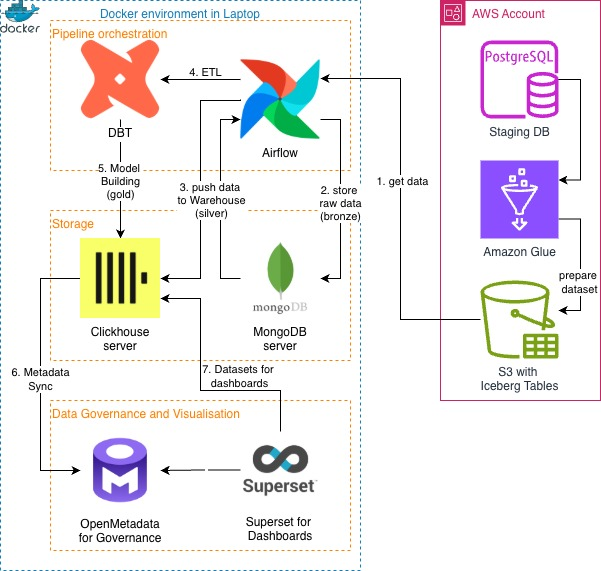

### **Data Flow**

1. **Source:** Paytech Datalake databases
2. **Ingestion & Pre-processing:** AWS Glue batch jobs
3. **Storage:** S3 → Iceberg tables
4. **Warehouse:** ClickHouse
5. **Reporting:** Apache Superset

**Batch frequency:**

* Weekly for staging datasets
* Daily for production datasets

---

### **Data Quality Checks**

* **Uniqueness:** `id` in InitialPayments must be unique
* **Nulls:** `reference` in Payments cannot be null
* **Timestamp logic:** `created_at` < `updated_at`

---
### **Instructions to run**
1. Write in docker CLI: docker compose up -d
2. Wait the start of each services:
[localhost:8080](http://localhost:8080) for airflow webserver, [localhost:8123](http://localhost:8123/) for clickhouse and [localhost:8081](http://localhost:8081/) for MongoDB. (It can take up to 1 minutes)
3. Log in into Airflow and MongoDB. (Airflow's username and passwords:airflow and MongoDB's username is 'admin' and password is 'password')
4. In Airflow webserver, we will see three separate DAGS: ingestion_pipeline, silver_transformations_pipeline and gold_layer_pipeline.
   * By running ingestion_pipeline, we start three operations: ingestion of link_transactions csv files into MongoDB and then ingestion from MongoDB to ClickHouse bronze layer; payment csv files into ClickHouse bronze layer; and merchants to ClickHouse bronze layer.
   * By running silver_transformations_pipeline, we start transformation and data quality check of three tables(link_transactions, payments and merchants) and ingestion them in silver layer.
   * By running gold_layer_pipeline, we created analytical models by creating dim_date, dim_merchants, dim_payment_state, dim_payment_method and fact_transactions.
5. As three dags files are responsible each layer data ingestion, we should wait the end of one to run another. The workflow for running dags:
run ingestion_dag and wait for its finish* $\quad\rightarrow$ run silver_transformation_pipeline and wait for its finish* $\quad\rightarrow$ run gold_layer_pipeline and wait its finish*.

P.S. As our data took from October 01.10.2025, we put start time for dags as October 1, 2025 so it will have all our data.

*wait until the finish means that last run should show previous day. 

---

### **DAG's Graph**

ingestion_pipeline DAG's Graph

silver_transformations_pipeline DAG's Graph

gold_layer_pipeline DAG's Graph

---

### **Analytical Queries**

1. How many initiated payments never reach a payment service provider?

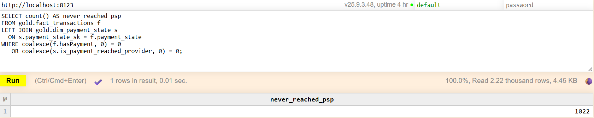

2. How many initiated payments reach a provider but are abandoned before completion?
   
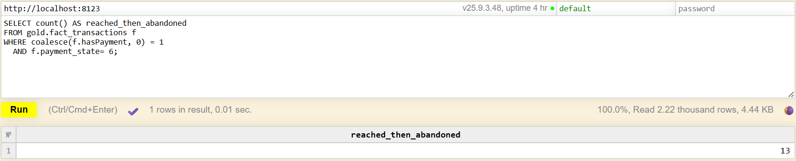

3. What is the abandonment rate by payment method?
   
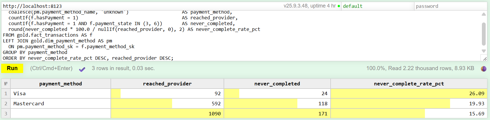

4. Which payment methods or providers show the highest share of initiated payments that never complete?
   
a)By payment method

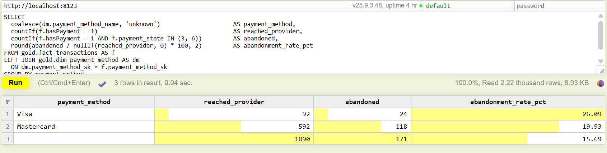

b)By merchant

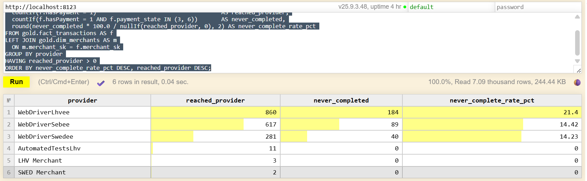

c)By both

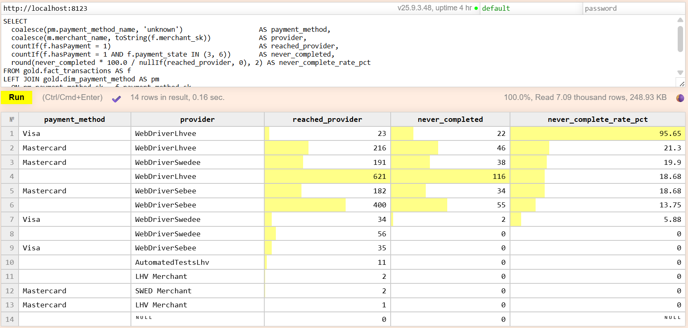

---

### **Project 3**

In Project 3, each part is dependent on each other, so it was inefficient to wait until the Iceberg part was finished. The creating the roles and Superset were done using Project 2 Star Schema and data.
Iceberg table part was also done independently.

---
### **What's new**

We changed compose.yml in the way that it took value from the .env file to improve security. 
We added Superset, Metadata and other changes in project. It is important to note that there was an issue with Superset, because .sh in superset compose were in crlf format, while they should be in lf. So be careful with that. 

---

### **Iceberg tables**

Iceberg tables ar implemented inside the AWS S3 bucket and the tables were created with AWS Glue Spark python scripts (iceberg_spark_jobs)

The first screenshot is showing the table format is Iceberg 

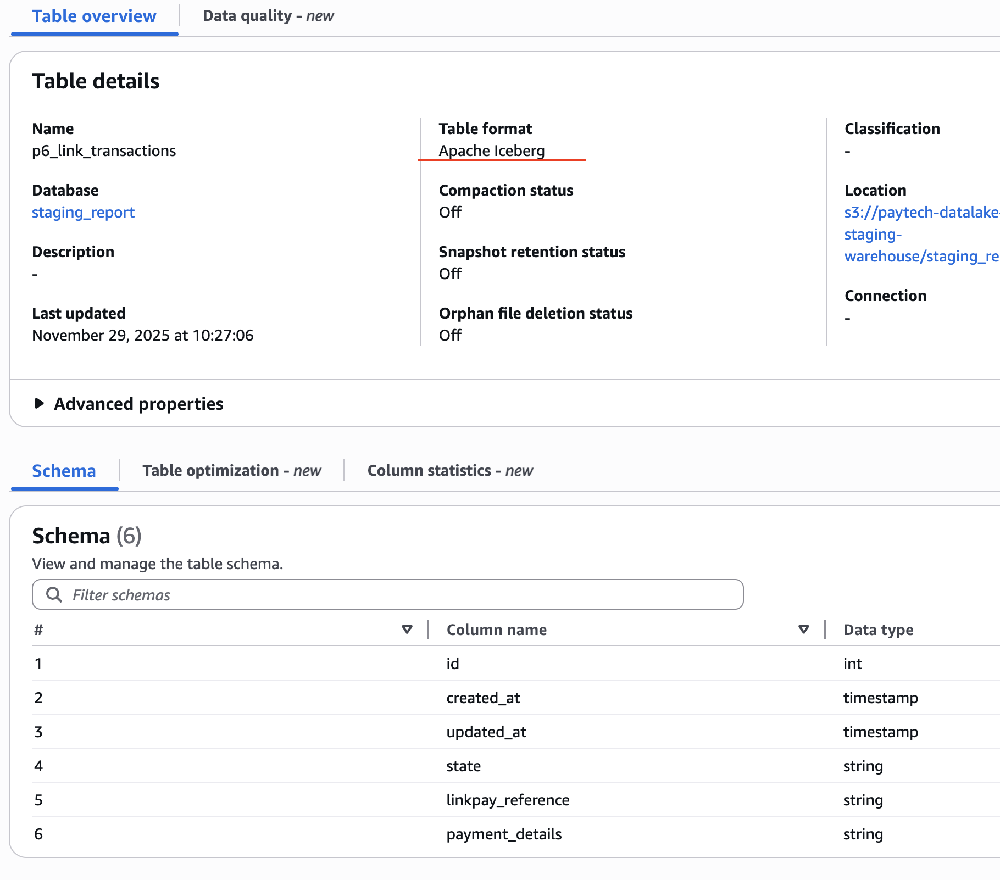

The second screenshot is showing the iceberg table data 

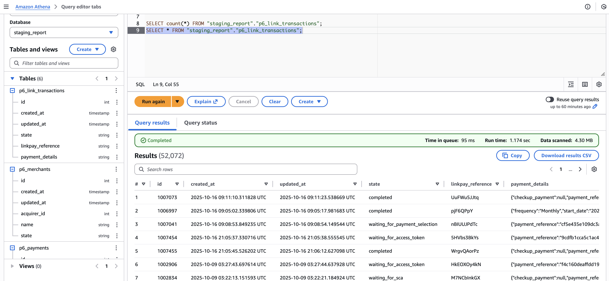

---

### **ClickHouse user's creation**

Two roles were created: two roles analyst_full and analyst_limited. Two users, intern_anup and analyst_hardi were created with passwords. The user intern_anup were assigned analyst_limited role, while analyst_hardi were assigned to analyst_full. Passwords are hard-coded in SQL for simplicity; in production we would externalize them to secrets / env vars and avoid committing them to Git.

There were 5 analytical views that answered our questions in the analytics database. Each of user have own version table:
analyst_limited has masked merchant name, provider name and bucket the reached provider number for each merchant and provider. 
!!! We have reached provider columns in other tables, but we did not bucket it because it is aggregated by provider or merchant, while we bucket reached provider number for each provider and merchant.

With Payment methods, I changed real names Visa, Mastercard and ACH transfer with Payment_Method_A, Payment_Method_B and Other_Method.
With Merchants, I replaced real merchant names with hashed codes.
With reached_provider, we bucketed it instead of exact counts with Low_Volume, Medium_Volume and High_Volume.

I run in docker console:
docker-compose exec clickhouse-server bash -c "clickhouse-client --user admin --password ${CLICKHOUSE_PASSWORD} --multiquery < /sql/user_create.sql
and wrote the password to execute the roles and get those tables.

The results:
Intern Anup's visible tables from analytics:
   
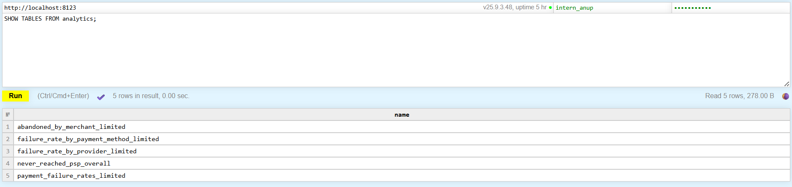

1. Anup's view for payment failure rate(payment_failure_rate_limited):

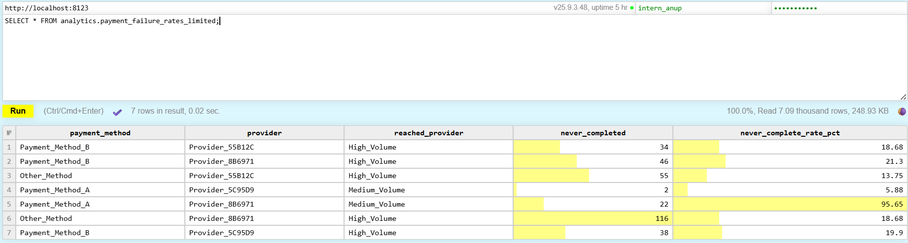

2. Anup's view for overall count of failure payment:

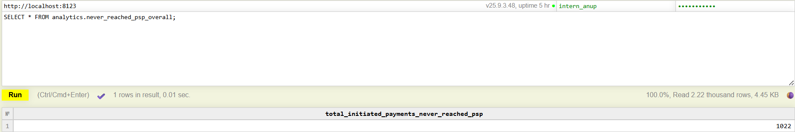

3. Anup's view for payment failure rate by provider (failure_rate_by_provider_limited):

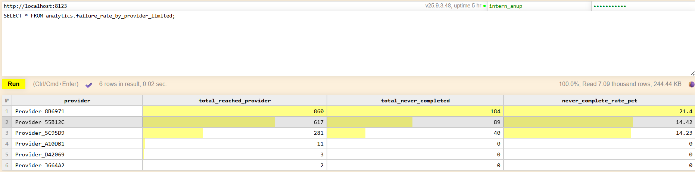

4. Anup's view for payment failure rate by payment method (failure_rate_by_payment_method_limited):

5. Anup's view for payment that reached and then failed (abondoned_by_merchant_limited):

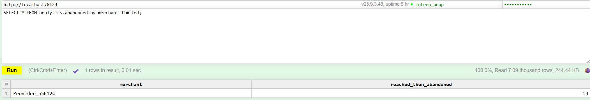

Hardi's analyst(full analyst) overall structure:

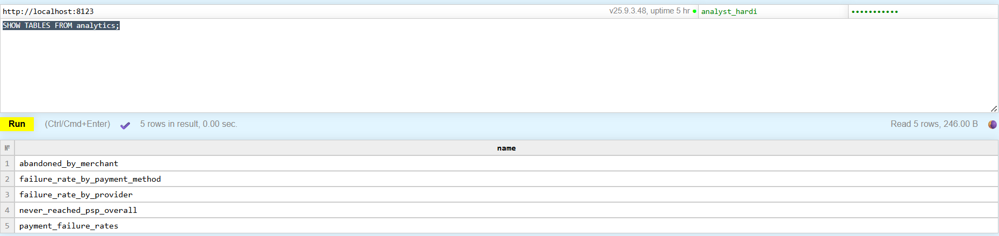

1. Hardi's view for payment failure rate(payment_failure_rate):

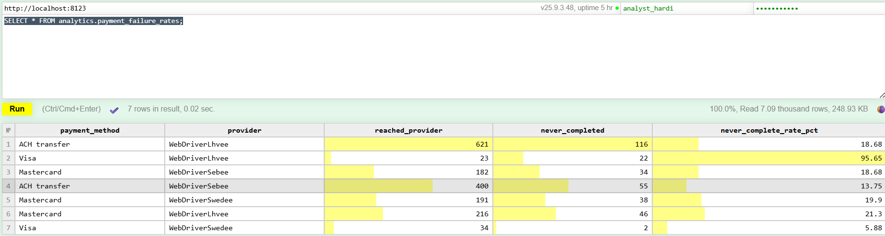

2. Hardi's view for overall count of failure payment:

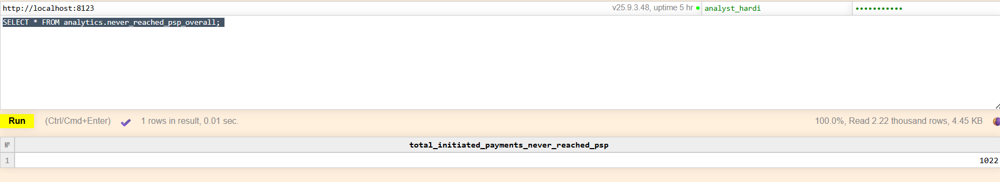

3. Hardi's view for payment failure rate by provider (failure_rate_by_provider):

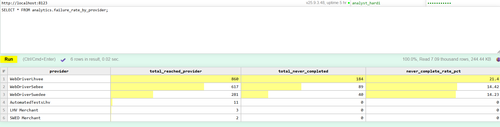

4. Hardi's view for payment failure rate by payment method (failure_rate_by_payment_method):

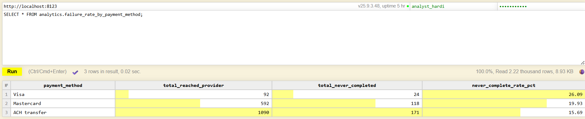

5. Hardi's view for payment that reached and then failed (abondoned_by_merchant):

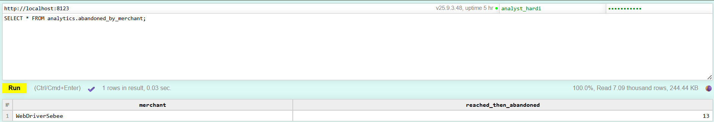

---

### **Superset**

If you want to use Superset:

Go to url: http://localhost:8088

Log in with default settings: admin as username and admin as password

Go to Settings -> Database Connection;

In new page, click on + Database button and in new pop-up window under “Or choose from a list of other databases we support:” choose ClickHouse Connect (Superset)

Fill out:

	Host: clickhouse-server
	Port: 8123
	Database Name: default
	Username: “Write here your clickhouse admin or user”
	Password: “Write here your clickhouse admin or user”
	Display Name: ClickHouse Connect (Superset)

Unfiltered dashboard using failure_rate_by_provider and failure_rate_by_payment_method:

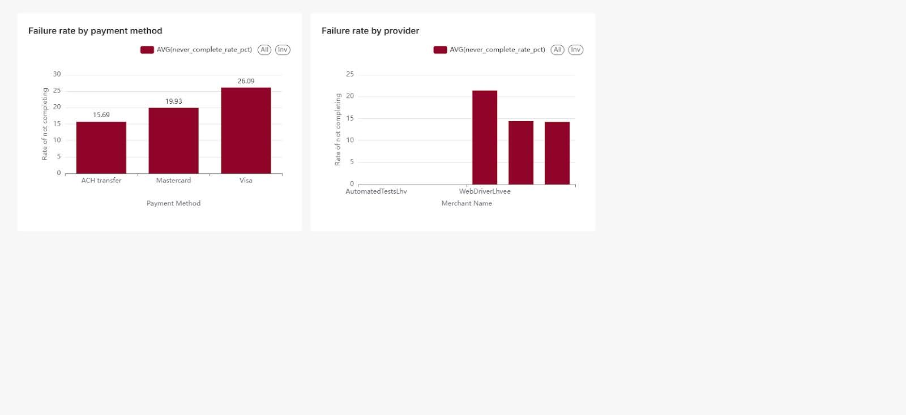

Filtering settings (payment method should have more than zero):

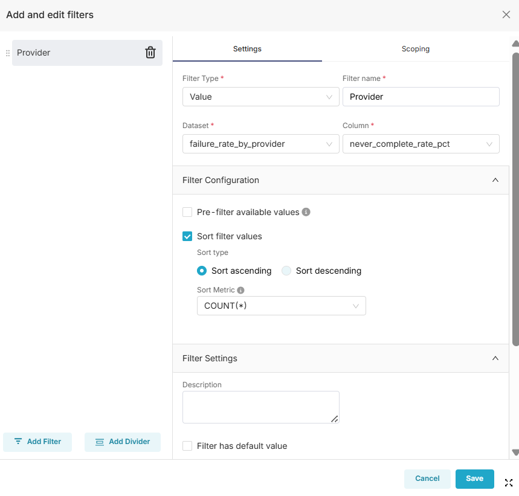

Filtered dashboard failure_rate_by_provider and failure_rate_by_payment_method:

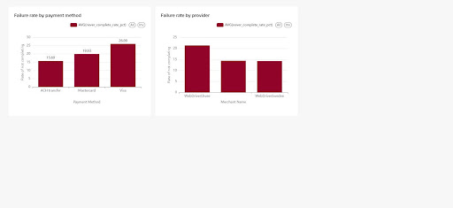

## 👩‍💻 Contributors

| Member               | Contribution                            |
| -------------------- | --------------------------------------- |
| **Anup Kumar**       | Tooling & Data Architecture             |
| **Bekarys Toleshov** | Data Model & Data Dictionary            |
| **Hardi Teder**      | Business Brief & Dataset Documentation  |
